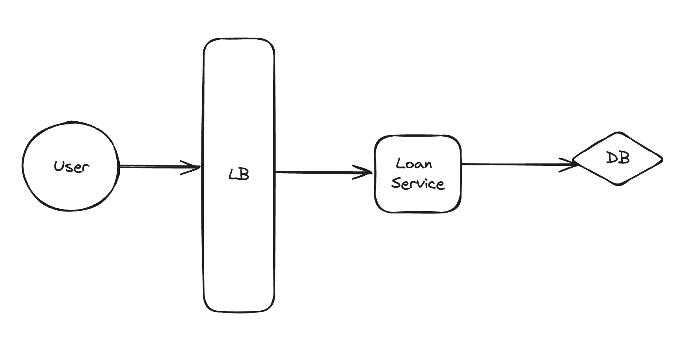

# amartha_code_test

System Design


Endpoints:
1. /loans [POST]
Example:
```
curl --location 'http://localhost:8080/loans' \
--header 'Content-Type: application/json' \
--data '{
    "principal": 5000000,
    "interest_rate": 10,
    "installment_term": 15
}'
```

2. /loans/{id}/schedule [GET]
```
curl --location 'http://localhost:8080/loans/1/schedule'
```

3. /loans/{id}/outstandingbalance [GET]
```
curl --location 'http://localhost:8080/loans/1/outstandingbalance'
```

4. /loans/{id}/status [GET]
```
curl --location 'http://localhost:8080/loans/1/status'
```

5. /loans/{id}/repay [POST]
```
curl --location 'http://localhost:8080/loans/1/repay' \
--header 'Content-Type: application/json' \
--data '{
    "paid_amount": 1000000
}'
```